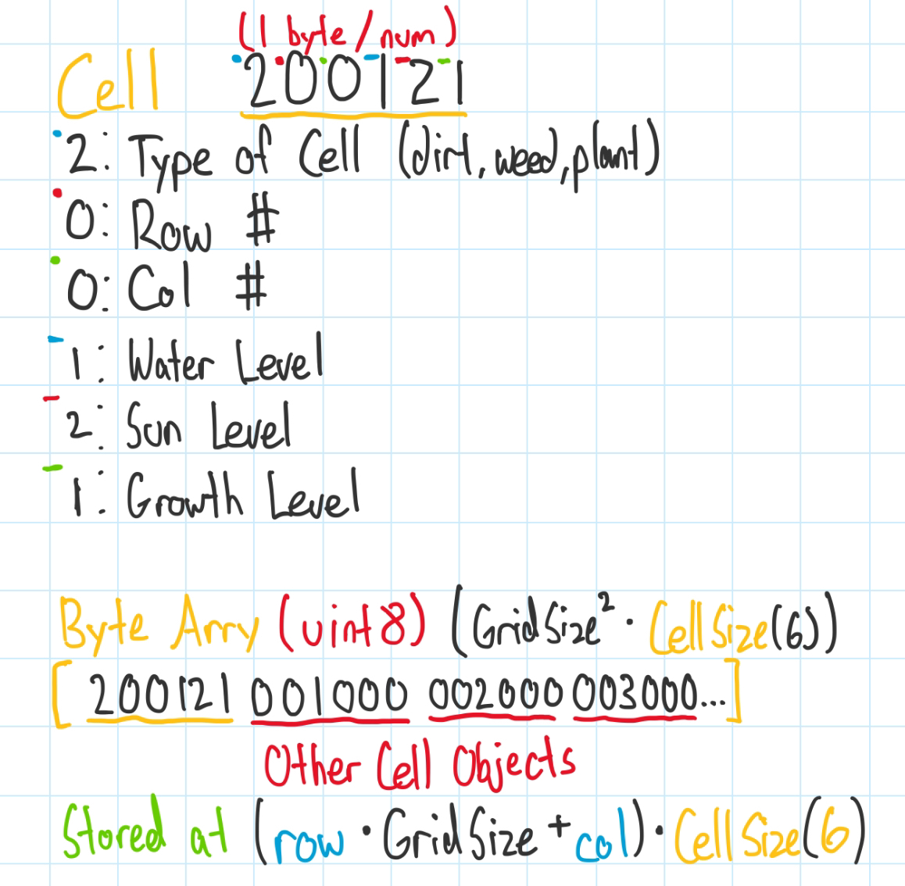

# Steven Ren - 11/19/2023

## Introducing the team

- Vincent Kurniadjaja - Tools Lead
- Steven Ren - Engine Lead
- Gordon Cai - Design Lead
- Jane Tran: General Assistant
- Tony Guizar: Backup

## Tools and materials

We decided to use Unity to make a 2d game. We chose Unity because there isn't a lot of overlap between the engines that we know between us and some of us are more experienced and comfortable with Unity than Phaser.

For Unity, we'll mostly be using C# as that is the language that Unity uses. We chose to use this lanaguage because a lot of us have past experience with them due to our past game projects and/or previous classes that taught them.

I expect us to use Visual Studio 2022 as that is the default IDE for Unity or maybe some of us will stick with Visual Studio Code instead. We want to keep our options open so we are considering form multiple sources like Tiled, the Unity Store, or other sources we find while doing research that seems promising. Some of us have experience with Tiled from CMPM120 and others have experience with the Unity Asset Store as well so if any of our members don't know how to use it, the rest of us can help them.

## Outlook

We anticipate the hardest part of this assignment to be the suprise requirements. The suprise requirements might cause us to redo and reformat a lot of our code in the future to meet the conditions and might even cause us to completely start from the ground up if the requirement is too out-of-the-way for our current code.
Through this project, we hope to hone our programming skills, and train them to be more flexible when suprise changes are needed. We also hope to learn more about our programming engine and how to work as a team to produce a game.

# Tony Guizar - 11/29/2023

## F0 devblog

F0 A: We have a Character class that is used to render a rectangle on a canvas representing the farmer. There is an event listener for arrow keys that changes the farmer's position and redraws the rectangle on the canvas.

F0 B: We have an event listener for the “t” key that simulates time by updating the game state with randomly generated values for weather and checking the plant growth, then logging the plant levels and game state.

F0 C: The player can move into a Cell and press the spacebar to interact with the cell. If there is a plant on the cell, the player is given the option to reap. If the cell is currently empty, the player is prompted to plant a plant of their choice.

F0 E: Each plant on the grid has a type: Sunflower, Rose, or Crabgrass(weed), each plant has a growth level, starts at 0 and grows based on sun and rain levels.

F0 F: Our Plant class has methods for simulating the effect of watering or exposure to sun based on the current sun and rain levels. Plant growth is unlocked when satisfying the water requisite and the sun requisite.

F0 G: To implement this scenario feature, we decided to create a separate class that will track 1 unique condition, the number required to satisfy the condition, as well as how far the player is to satisfy to max total. To keep things organized, we decided to put this class (known as Scenario) into its own TS file, called scenario.ts. After testing, we integrated the class by including an update function to update said class that is called each time the player changes the time.

Reflection
Our group didn’t really have much plans on what we wanted to do together at the start. All of us focused on just satisfying the requirements, with each member working on different classes and sections. When it came time to integrate everything together, we found that it was hard to follow which parts belonged to what, since we haven’t communicated how something was implemented, which made changing and adding on to code be confusing. We also are learning to resolve merge conflicts as well. What we have for F0 is basically a skeleton of the basics of the game, and moving forward, we are going to communicate more often and clearly about what our vision of the final game should be, and what steps we need to do to satisfy it.

# Steven Ren - 11/29/2023

## F0 devblog

F0 D: Depending on the current weather, there is a different chance of each cell getting water and sun. When it rains, there's a 70% chance of a cell getting 2 levels of water and a 20% chance of getting sun. When it's sunny, there's a 70% chance for a cell to lose a level of water and a 80% chance to get sun. It is not possible to lose water levels on a rainy day but there is also no ways to gain water levels on a sunny day. Each cell's sun is independent of each other.

# Tony Guizar & Vincent Kurniadjaja & Steven Ren - 12/6/2023

## F1 devblog

## F1 A: Bytearray diagram



## F1 B:

The undo/redo system is implemented by tracking game states across play. When the player interacts with a cell, the new game state is pushed to an array of `GameState` objects. When a player wants to undo their last action, the current game state is popped from the `states` array and pushed to a `redoStack` array. The previous game state which is now the newest element in the `state` array is then applied to the current game state and all UI is updated. Similarly, when the player has a redo action available, the gamestate is popped from the `redoStack` and pushed to the `states` array and is then applied to the current game state, then the UI is updated.

## F1 C:

The player is able to manually save their current game using the “S” key. The player is prompted to select an optional name for their saved game. A saved game is just an array of `GameState` objects and we used a map called `savedGameStates` that maps strings(names of saved games) to arrays of `GameState` objects. We have an event listener for “beforeunload” event that will save the `savedGameStates` map to local storage before the document is unloaded. The player can also load a saved game using the “L” key. The player will be prompted to select a saved game and the array of `GameStates` will replace the current `states` array, allowing the player to load a saved game while still having access to their game state history, preserving the undo/redo system across loaded games. The player can also use the “d” key to delete all saved games and start the game over.

## F1 D:

The implicit auto-save feature is implemented as an array of `GameState` objects that are saved to localstorage. Whenever a player interacts with a cell, or passes time using the “t” key, the new game state is pushed to a `states` array that holds the game state history for the current game. When the game is loaded, the code checks if there is a “states” key in localstorage, and if there is, that game is loaded into the current game, allowing players to resume play in the event of an unexpected quit.

## Reflection:

Our previous code wasn’t compatible with an und/redo button so we had to refactor our code. We added game states which act as a stack and push and pop accordingly to the player’s actions to simulate a redo and undo action. These game states update whenever a cell is interacted with and tracks which element(s) the player manipulated.

One of the larger refactoring overhauls we did to our code came in when we implemented the Byte Array. In our initial implementation of the grid, we basically tracked row, column, and the plant in each cell. However, there were issues with this implementation that prevented a smooth conversion into a byte array. Since we stored an entire class into a cell in the form of a plant, it made it infeasible to store the entirety of a plant and needing to parse its 9 or so parameters.

So before making the byte array, we stripped out all of the mutable forms of the plant and stored it into the cell object. In our new cell class, we tracked that cell’s position as rows and columns, its current water level, the sun that cell is receiving, its growth level, and what type of plant it was. When refactoring code, we also noticed how the only difference between plants were its requirements to grow, which led to us to define the cellTypes enumerator that defined all possible cells that a cell could be. We later expanded this to include the dirt (empty cell) and well as the weed (a cell that must be reaped first). This new cell representation is conveniently created with 6 bytes

After redefining a cell, we then refactored our grid class to go from a cell matrix (Cell[][]) into a contiguous byte array whose size is equal to the number of available grids multiplied by the size of a cell (6). Actually implementing the byte array was simple, we chose to do an array of structures to store our data, which allowed us to look at 6 adjacent bytes at a time to access our cell data.

The problem came with trying to fix all of our existing code after messing with the plant class and the grid, 2 aspects of our code which many other objects depend upon. Although it did take a bit to refactor all of the code, it wasn’t that difficult to convert all of the old grid matrices into the new byte array, since when implementing the grid array, we had helper functions that was able to index and store cells using rows and columns, exactly how we stored cells in the old matrix. The more difficult aspects of the refactoring came from dealing with the manipulation of the matrix when we saved and loaded objects. Since we converted the grid into a json in order to save all of the game's states, a lot of errors came up since byte arrays are more finicky when doing that conversion as opposed to a double array.

Although this cleaning of the code is tedious, it is necessary in order to have a smoother development process down the line. Even when implementing the code and reflecting on it, some of the immediate next steps is to refactor the refactored code since we found out that there are ways to further simplify the code.

# Tony Guizar, Gordon Cai, Vincent Kurniadjaja, Steven Ren, Jane Tran - 12/11/2023

## F2 Devlog

### F0+F1

We moved some of the helper functions to be class methods in our `Game` class to associate the functions with the `Game` object, as well as reduce the amount of loose functions within the code. In the process, we broke the auto-save functionality of the game, so we had to go back and fix that. These did not affect the overall functionality of F0 and F1. We also added some slight UI changes for the player. We added on-screen controls, as well as a list of the current game requirements and scenarios..

### F2 External DSL for Scenario Design

```
{
    "events_schedule": [
      {
        "time": 2,
        "name": "WeedGrowth",
        "row": 4,
        "col": 2,
        "complete": false
        }
    ],
    "starting_conditions": [1, 6],
    "victory_conditions": {
      "harvest_goal": [1,1,1]
    }
  }

```

```
export class Scenario {
  private events_schedule: Event[];
  private starting_conditions: number[];
  private victory_conditions: VictoryConditions;
  private current_harvest: number[];
  private current_time: number;

  constructor(jsonScenario: JSONScenario) {
    this.events_schedule = jsonScenario.events_schedule;
    this.starting_conditions = jsonScenario.starting_conditions;
    this.victory_conditions = jsonScenario.victory_conditions;
    this.current_harvest = [];
    this.current_time = 0;
  }
}
```

We decided to use JSON as our external DSL to define gameplay scenarios like events, starting conditions, and victory conditions . Below is an example of one of our scenario definitions:

From the JSON, any potential designers can define the scenario’s name, amount of rows, columns, frequency of any scenario conditions, as well as the victory conditions of the game. The `harvest_goal` is an array of numbers to work in conjunction with our plant definition internal DSL, where each plant is associated with an index in the array and the value in that index represents the required number of harvested plants.
In our scenario.ts file, the scenario,json file is read and parsed into a scenario that is playable within the game.

### F2 Internal DSL for Plants and Growth Conditions

```
// Example usage:
// flower [name] [color] [sunReq] [waterReq] [vibeReq: 0-> none, 1->requires alone, 2->requires friends, 3->requires family]
// weed [name] [color] -> [persistence (1-10)] <- this last one not implemented yet

const dslCode = `flower Sunflower yellow 3 2 0
flower Rose pink 2 3 0
flower Daffodil #FFD700 3 2 0
flower Lily #FFFFFF 2 3 0
flower Marigold #FFA500 4 2 0
flower Fuchsia #FF00FF 3 3 0
weed crabgrass green`;
```

This is the Internal DSL that we are using in our game. The host language is Typescript. The plants contain 4 fields for their names, colors, sun requirements, and water requirements. There is an optional 5th requirement that is dependent on the number and type of plants that surround it.
This is implemented using a kind of [subclass sandbox](https://gameprogrammingpatterns.com/subclass-sandbox.html) pattern where there is a base `PlantCommand` interface that contains an `addTo` method. The keywords `flower` and `weed` construct their respective `FlowerCommand` and `WeedCommand` classes with the provided attributes. Then the ‘addTo’ method is called on each command object, which simply takes a `Plant[][]` representing the array of plant definitions, and appends this plant definition to it.

## Reflection

Looking back on how you achieved the new F2 requirements, how has your team’s plan changed? Did you reconsider any of the choices you previously described for Tools and Materials or your Roles? Has your game design evolved now that you've started to think about giving the player more feedback? It would be very suspicious if you didn’t need to change anything. There’s learning value in you documenting how your team’s thinking has changed over time.
Our team’s plan has not changed very significantly. With every design requirement, our game is getting much more modular and organized.The jump from F0 to F1 was rough due to the fact that our team had to completely rebuild what we had. In order to avoid this, we are constantly refactoring the code to account for potential new requirements.
